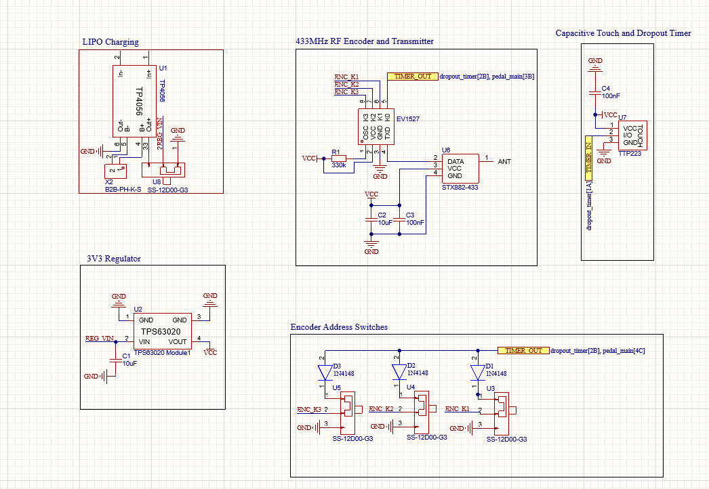
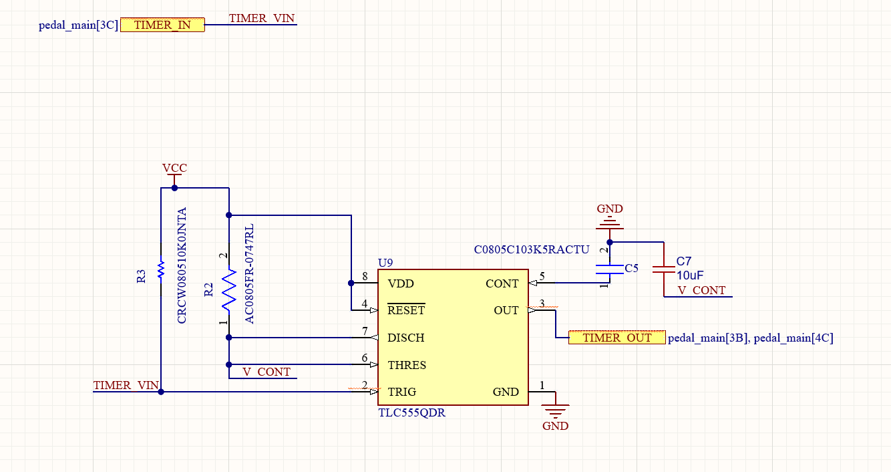
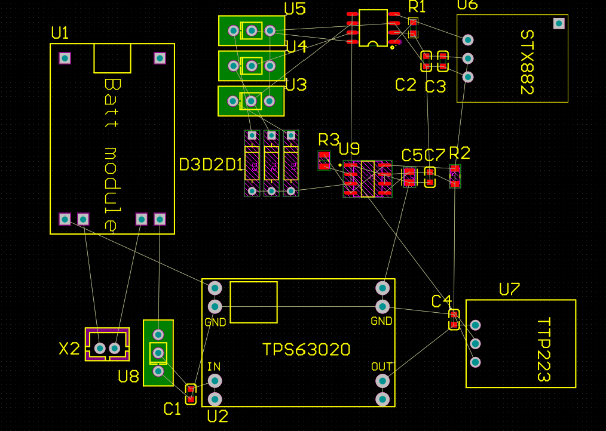

# EinkFootPedal
Schematics and PCB designs for a capacative touch radio transmitter board

**This project is still in progress, but the initial schematics and layout are included below.**

# Initial Schematics:

# Initial Layout:

