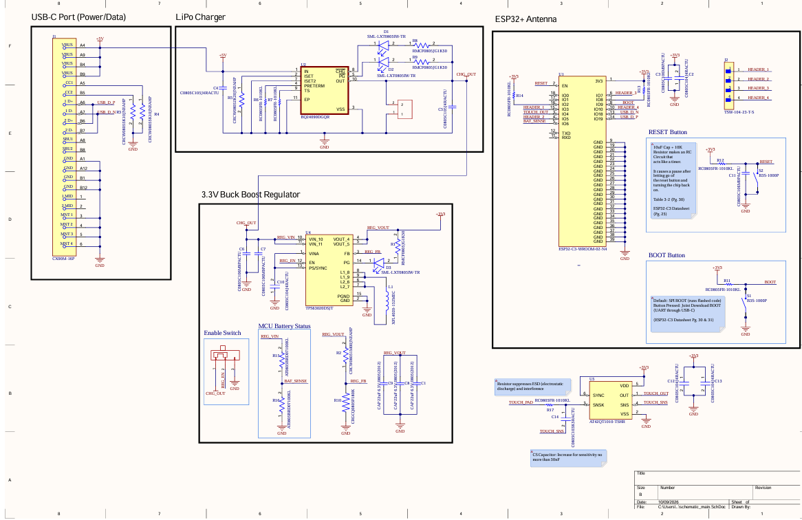
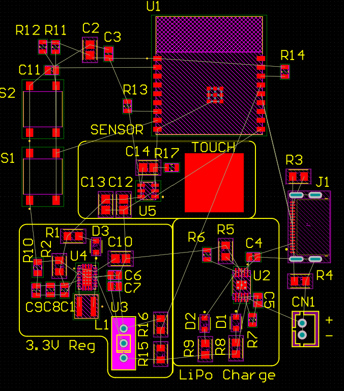

# EinkFootPedal
Schematics and PCB designs for an ESP32-based Bluetooth capacative touch board. 

## Features
* 3.3V Buck boost regulator using a TP63020 IC
* LiPo Charger with indicators using a BQ24090 IC
* USB-C-2.0 interface for programming and power
* (in-progress) GPIO headers for alternative uses

**This project is still in progress, but the initial schematics and layout are included below.**

## Initial Schematic:

## Initial Layout:

## Initial Routing:

