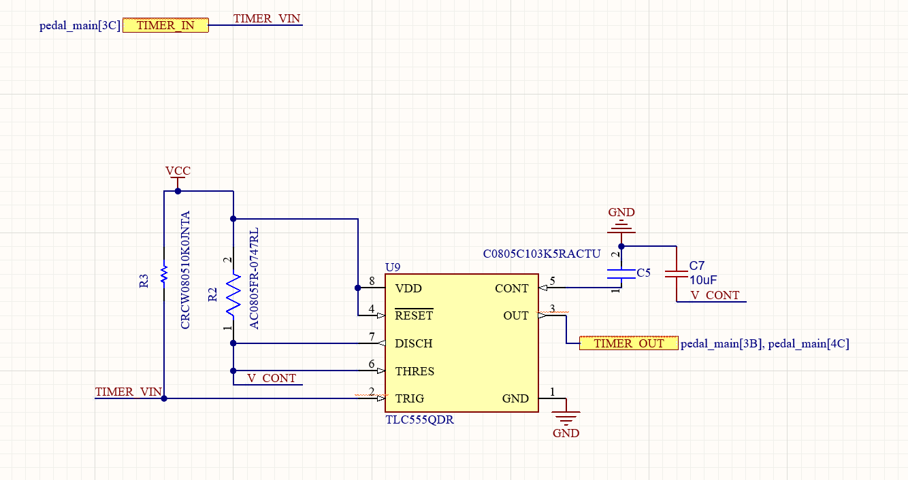

# EinkFootPedal
Schematics and PCB designs for an ESP32-based Bluetooth capacative touch board. 

**This project is still in progress, but the initial schematics and layout are included below.**

# Initial Schematics:

# Initial Layout:

